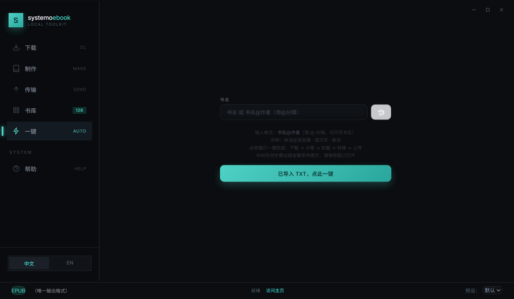
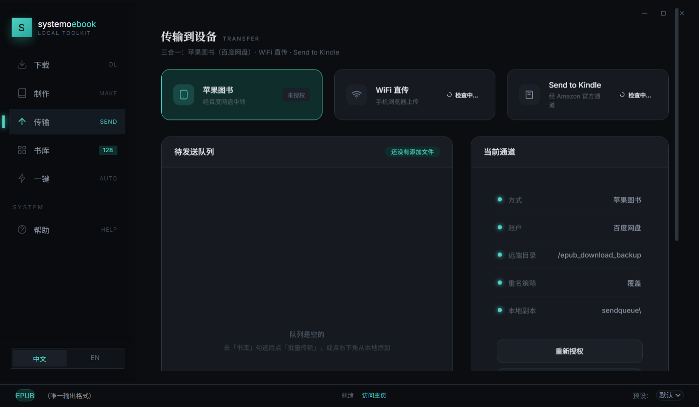
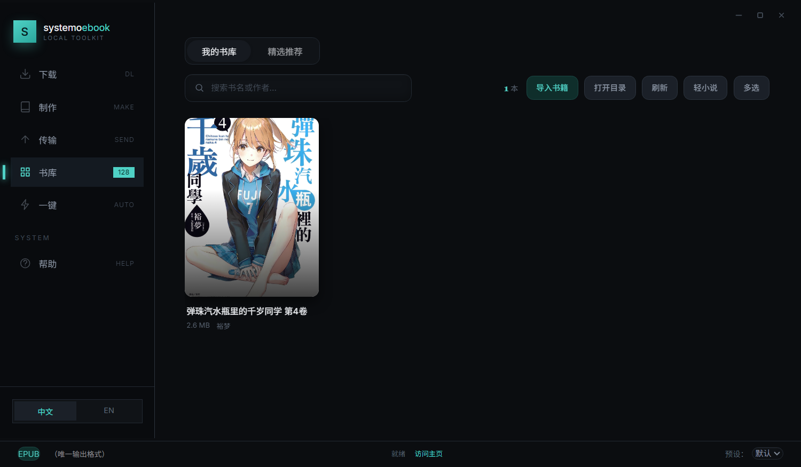
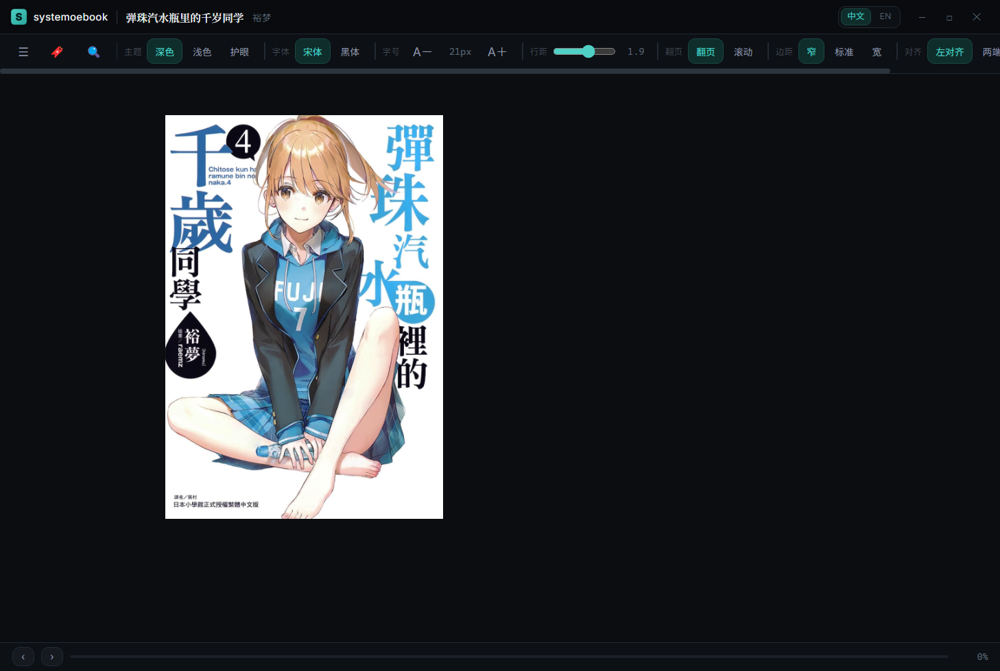
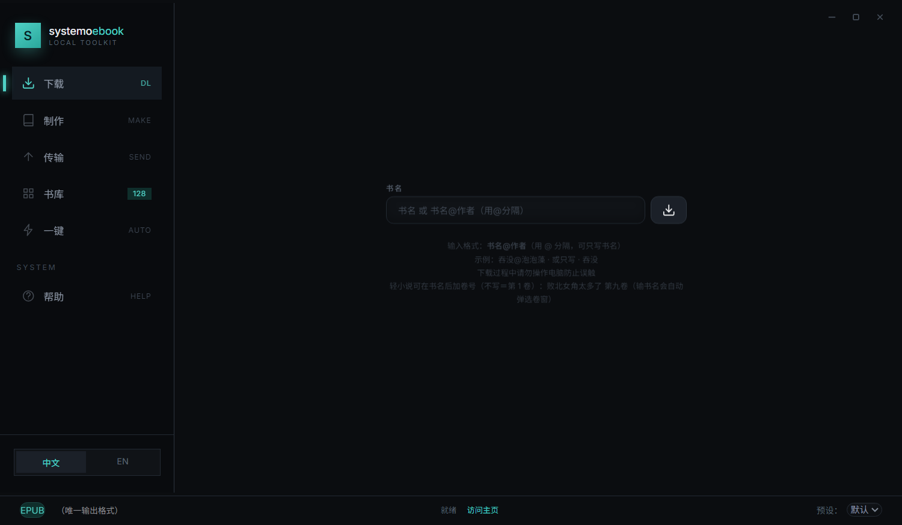

<div align="center">


# systemo ebook

**Windows 电子书工具：TXT 自动分章 → 搜作者/封面 → 生成带封面 EPUB → 一键传到手机 / Kindle / 苹果图书**


</div>

> **本仓库是「阉割版」**：界面与功能完整，**在线下载不开放**（点下载按钮提示"该部分暂不开放使用"）。
> 分章、搜作者/封面、生成 EPUB、三条传输通道、书库 —— **全部正常可用**。

---

## 📸 界面

| 一键完成 | 制作 / 分章 |
|---|---|
|  |  |

| 传输到设备（三条通道） | 书库 |
|---|---|
|  |  |

| 精选推荐（多源榜单） | 自带阅读器（foliate-js） |
|---|---|
|  |  |

| 在线查询（本版只开放查询） |
|---|
|  |

---

## ✨ 功能

| 模块 | 说明 |
|---|---|
| **一键完成** | 输书名 → 自动分章 → 联网搜作者 → 搜封面 → 生成 EPUB → 传到你选的目标 |
| **TXT 分章** | 自动识别章节（卷/章/节），可手动增删改、实时预览 |
| **作者 / 封面** | 多源联网查询（微信读书、番茄、晋江、起点、轻小说等）；同名作者给出候选由你挑；小图自动升级成大图 |
| **EPUB 生成** | 封面、目录、章节分页、标题长度上限等可调 |
| **三条传输通道** | ① 苹果图书（经百度网盘中转）② **WiFi 直传**（手机浏览器打开地址即收）③ **Send to Kindle**（Amazon 官方） |
| **精选推荐** | 多源榜单聚合（微信读书 / 起点 / 番茄 / 晋江 / 轻小说…），支持**综合推荐 / 轻小说**切换、一键刷新；左键看下载弹窗、右键看详情 |
| **自带阅读器** | 内置 **foliate-js** 引擎，双击书库里的书直接开读：目录 / 书签 / 全文搜索 / 主题（深色·浅色·护眼）/ 字体 / 字号 / 行距 / 翻页与滚动模式 / 边距 / 对齐方式 |
| **书库** | 已生成书籍管理、批量传输、封面预览 |
| **轻小说** | 哔哩轻小说书号 / 网址查询（本版只开放查询） |

---

## 🏗 架构

```
┌──────────────────────────── Electron ────────────────────────────┐
│  渲染层（无框架，原生 JS）                                          │
│    index.html · library.js · i18n.js · settings-ui.js · dark.css   │
│         │  window.electronAPI.*（preload.js / contextBridge）      │
│  主进程 main.js                                                    │
│    · 窗口与 IPC  · 三条传输通道  · 暂存队列 sendqueue\             │
│    · 把子进程 stdout 转发到渲染层 + 写入 logs\upload-*.log         │
└───────────────────────────────┬──────────────────────────────────┘
                                │ spawn
        ┌───────────────────────┴────────────────────────┐
        │ 开发：python  xxx.py                            │
        │ 打包：resources\backend\easypub-backend.exe     │ ← PyInstaller 冻结
        └───────────────────────┬────────────────────────┘
                                │ stdout: @@INFO / @@PROGRESS / @@RESULT / @@RANK + JSON
┌───────────────────────────────┴──────────────────────────────────┐
│  Python 侧                                                       │
│   epub_generator.py   TXT → 分章 → EPUB（封面/目录/章节）         │
│   meta_lookup.py      ★ 作者/封面联网查询（多源 + 硬校验 + 升级） │
│   novelmeta/          书源适配层（sources.py / rank_pool.py …）   │
│   linovelib.py        哔哩轻小说（查询；下载在阉割版不开放）      │
│   ai_cover.py         封面兜底（Selenium 驱动 Chrome）            │
│   wifi_upload.py      WiFi 直传（Selenium 自动上传到手机页面）    │
│   get_auth_code.py    百度网盘授权                                │
│   image_enhancer.py   封面增强（onnxruntime + Pillow + numpy）    │
│   backend_entry.py    打包入口（把以上模块串起来）                │
└──────────────────────────────────────────────────────────────────┘
```

**三条传输通道的实现**：

| 通道 | 实现 |
|---|---|
| 苹果图书 | `bypy` → 上传到百度网盘 → 手机端「苹果图书」/「文件」App 取回 |
| **WiFi 直传** | 本地起 HTTP 服务 + `Selenium` 驱动 Chrome 自动把文件上传到手机打开的页面（要求同一局域网） |
| Send to Kindle | Amazon 官方通道（登录后走网页上传） |

**进程间协议**：Python 每个阶段向 stdout 打一行 `@@MARKER {json}`，主进程解析后转发给界面
（`@@INFO` 提示 / `@@PROGRESS` 进度 / `@@RESULT` 结果 / `@@RANK` 候选排序）。

---

## 📦 依赖与安装包

### 运行时（用户）：**什么都不用装**

直接下载 [Releases](../../releases) 里的 `systemo ebook.rar` → 解压到**可写目录**（别放 `C:\Program Files`）→ 双击 `EasyPub.exe`。
包内已自带：**Python 后端（PyInstaller 冻结的 `easypub-backend.exe`）**、`chromedriver.exe`、`pandoc-3.10.2\`。

### 从源码跑（开发者）

| 类别 | 需要 | 说明 |
|---|---|---|
| **Node.js** | 18+（实测 20） | 跑 Electron |
| **Electron** | `^27.3.0`（devDependency） | 桌面壳 |
| **electron-builder** | `^24.0.0`（devDependency） | 打包 |
| **Node 运行依赖** | `@readium/css` `foliate-js` | EPUB 阅读/排版样式 |
| **Python** | **3.11+** | 后端脚本 |
| **浏览器** | **Google Chrome**（本机安装） | Selenium 驱动它完成 WiFi 直传 / 封面兜底 |
| **Pandoc** | 3.10.2（已随包） | 格式转换 |

**Python 依赖**（完整见 [requirements.txt](requirements.txt)）：

| 库 | 用途 |
|---|---|
| `selenium` + `webdriver-manager` | WiFi 直传、封面兜底、授权页自动化 |
| `Pillow` + `numpy` | 封面处理与尺寸检测 |
| `onnxruntime` | 封面增强模型推理 |
| `pywinauto` + `PyAutoGUI` + `pywin32` | Windows 窗口/剪贴板自动化 |
| `requests` | 书源联网查询 |
| `bypy` | 百度网盘上传（苹果图书通道） |
| `openai` | 可选的 AI 辅助（本版非必需） |

一条命令装齐：

```powershell
pip install -r requirements.txt
npm install
npm start                     # 开发模式
npx electron-builder --dir    # 打免安装版（产物在 dist\win-unpacked）
```

> 打包前请确认 `settings.json` 里没有个人凭据 —— 仓库的 `.gitignore` 已排除 `settings.json`、
> `kindle_config.json`、`wifi_urls.txt`、`*cookies*` 等隐私文件。

**目录约定**：配置与数据都在**程序自己目录**下（`settings.json`、`logs\`、`export\`、`sendqueue\`），
整个目录拷走即迁移，**不含任何账号信息**。

---

## 🔧 首次使用要配置什么

- **苹果图书通道**：先在「传输」页做一次**百度网盘授权**；
- **Send to Kindle**：需要**登录 Amazon 账号**；
- **WiFi 直传**：手机和电脑连**同一个 WiFi**，把手机上显示的地址填进弹窗，再点「开始传输」。

## 📄 说明

- 本工具仅供**个人学习与自有文档整理**使用，请勿用于传播盗版内容；
- 联网查询到的作者 / 封面信息来自各公开站点，版权归原站点与作者所有；
- 本仓库为**阉割版源码**（在线下载不开放），成品安装包见 [Releases](../../releases)。
